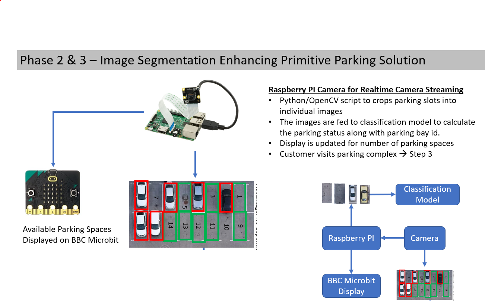

# AutoDroneValetParking
## DGMD E-17 (26008) - Robotics, Autonomous Vehicles, Drones, and Artificial Intelligence

### Phase 2 & 3 - Image Segmentation & CNN Classification Model

* In this phase, the primitive parking solution just counts the number of parking space agailable.
* The phase-1 project makes the assumption that, the parking bays are painted with Aruco markers.
* Open CV library is used to count number of visible aruco markets (i.e. free parking spaces)

### Phase 1 Overview

### Code

1. **Step02_ClassificationMode:** This jupyter notebook model trains the CNN classification model to detect whether a parking bay is occupied or free.
2. **Step03_ParkingStatusPrediction:** This jupyter notebook is to test the CNN classification model.
